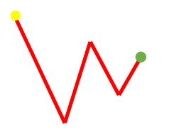
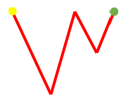
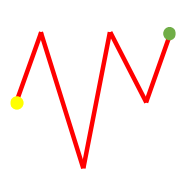
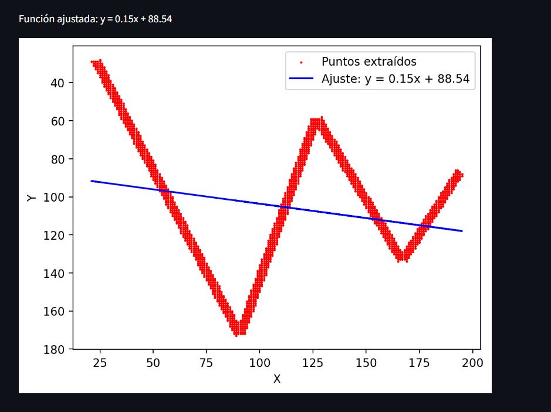
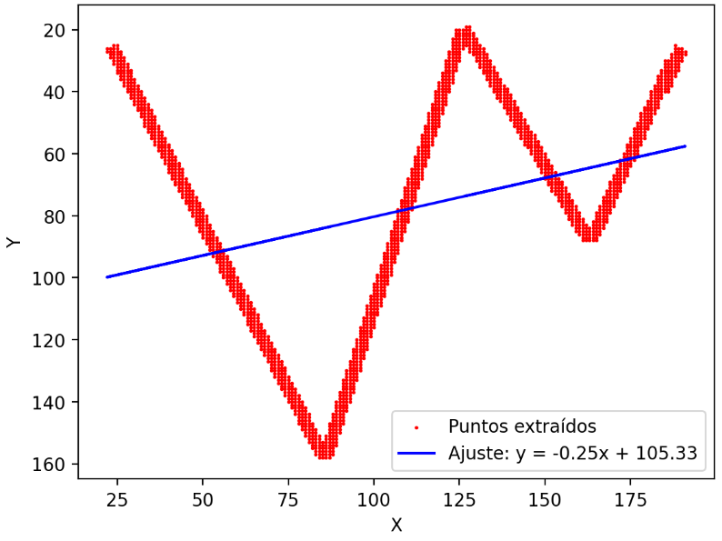
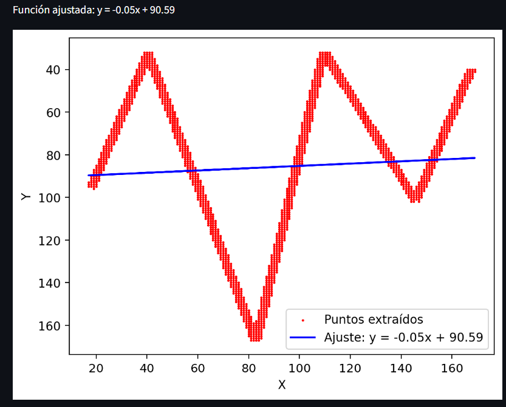
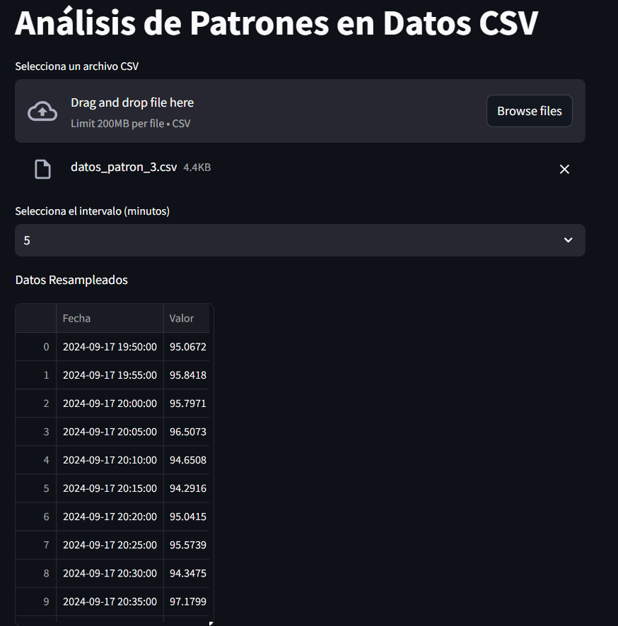
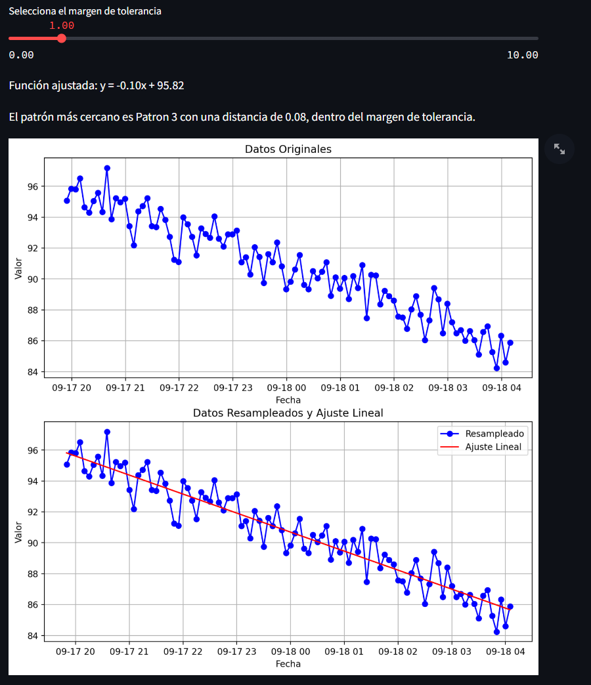

# Análisis de Patrones en Datos CSV con Streamlit

Este proyecto permite analizar patrones lineales en conjuntos de datos de series temporales. Utiliza **Streamlit** como interfaz gráfica para cargar archivos CSV, resamplear datos, ajustar patrones lineales, y comparar estos ajustes con patrones predefinidos. El usuario puede definir un margen de tolerancia para evaluar si los datos ajustados se asemejan a los patrones dados.

## Características

- Carga de archivos CSV para análisis de datos.
- Resampleo de los datos según intervalos de tiempo seleccionados (5, 10, 15, o 30 minutos).
- Ajuste automático de una función lineal a los datos resampleados.
- Comparación de la línea ajustada con tres patrones predefinidos.
- Posibilidad de definir un margen de tolerancia para evaluar la similitud con los patrones.
- Visualización de los datos originales, los datos resampleados y la línea ajustada.

## Requisitos
- **anaconda.navigator**
- **python 3.12.6**
- **Streamlit**
- **NumPy**
- **Pandas**
- **Matplotlib**
- **SciPy**

### Instalación de dependencias

Para instalar las dependencias necesarias, ejecuta el siguiente comando:

```bash
pip install streamlit numpy pandas matplotlib scipy
```
para iniciar el programa utilizamos
```bash
streamlit run funcon.py

streamlit run practica.py
```
lo primero que hice fue tomar las 3 graficas que me dieron 
- 
- 
- 

y crear un programa que detectara su ajuste para asi comparar los datos que se ingresaran al csv  con estos ajustes

- 
- 
- 
## programa
y una vez con esto podremos subir nuestro archivo csv donde se realizaran las funciones que se nos pidieron y nos indicara  el patron al que mas se acerca la grafica de nuestros datos csv
- 
- 
